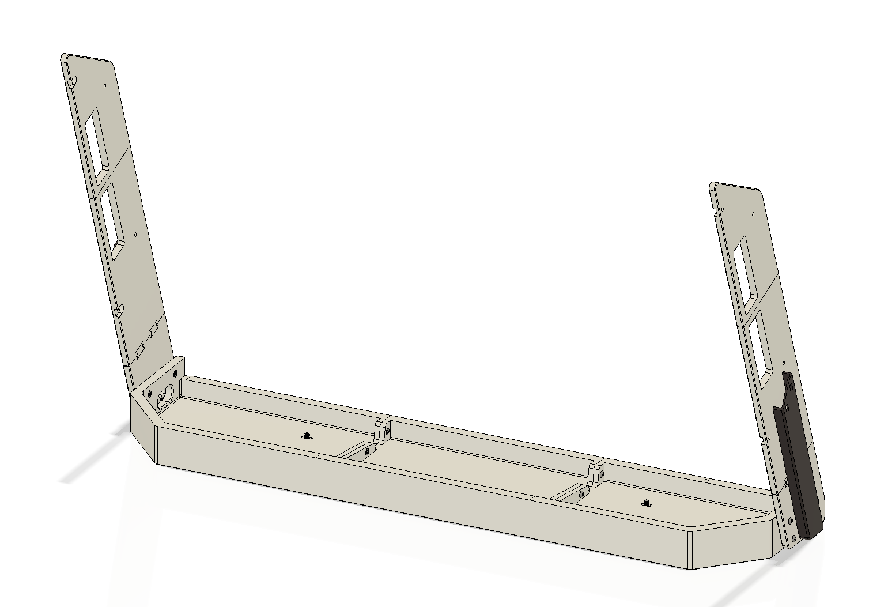

# chuni-slider-case

Chunithm arcade Ground Slider and Air Strings 3d printed case.

I have included the STEP file, you can use it to see where the screws go, or modify the model to your needs.

For the Air Strings, reuse the original screws.

## Print files

- Case - Left.3mf
- Case - Middle.3mf
- Case - Right.3mf
- Air Tower - Joint x4.3mf
- Air Tower - Left - Bottom.3mf
- Air Tower - Left - Middle.3mf
- Air Tower - Left - Top.3mf
- Air Tower - Left - Cable Cover.3mf
- Air Tower - Right - Bottom.3mf
- Air Tower - Right - Middle.3mf
- Air Tower - Right - Top.3mf
- Air Tower - Right - Cable Cover.3mf

## Hardware needed

- 14x M4 Nuts (width of nut to be 6.8mm or smaller.)
- 6x M4x18mm
- 8x M4x12mm (or longer)
- 4x M3x16mm countersunk
- 4x M5x8mm

There is a alternate STEP file which is customized to my needs. It includes a slot and case for an aime card reader on the front, detachable magnetic air towers, headphone port panel, PCB mount for redboard and a buck converter, 108mm riser (for arcade height on my table).
